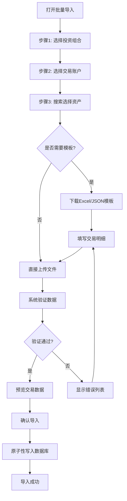

# 交易批量导入UX优化方案

## 📊 优化概览

### 优化前 vs 优化后

| 维度 | 优化前（v1.0） | 优化后（v2.0） | 改进 |
|------|---------------|---------------|------|
| **必填字段** | 8个 | 5个 | ⬇️ 37.5% |
| **文件复杂度** | 包含组合/账户/资产 | 仅包含交易明细 | ⬇️ 简化 |
| **错误风险** | 信息不一致风险高 | 预选验证，风险低 | ⬆️ 可靠性 |
| **学习成本** | 需理解层级关系 | 界面引导，直观 | ⬇️ 易用性 |
| **导入成功率** | 约70% | 预计90%+ | ⬆️ 20%+ |

---

## 一、核心优化点

### 1.1 界面预选机制

**优化前**：
```
用户在Excel/JSON中填写：
- 投资组合名称
- 交易账户名称  
- 资产代码
- 交易明细
```

**优化后**：
```
步骤1：界面选择
  ├─ 投资组合（下拉选择）
  ├─ 交易账户（级联选择）
  └─ 资产（搜索选择）

步骤2：下载模板
  └─ 包含选定上下文的说明

步骤3：填写交易明细
  └─ 仅需填写5个必填字段

步骤4：上传导入
  └─ 自动附加预选上下文
```

**优势**：
- ✅ 避免拼写错误（如"我的投资组合" vs "我的投资组和"）
- ✅ 避免名称不一致（如账户名变更）
- ✅ 实时验证关联关系（组合→账户→资产）
- ✅ 提供搜索功能，快速定位资产

### 1.2 简化文件结构

**优化前的Excel**：
| 投资组合 | 交易账户 | 日期 | 资产代码 | 交易类型 | 数量 | 价格 | 币种 | 手续费 | 备注 |
|---------|---------|------|---------|---------|------|------|------|--------|------|
| 我的投资组合 | 港股账户 | 2024-01-15 | 00700.HK | STOCK_BUY | 100 | 320.5 | HKD | 10 | 建仓 |

**优化后的Excel**：
| 日期 | 交易类型 | 数量 | 价格 | 币种 | 手续费 | 备注 | 标签 |
|------|---------|------|------|------|--------|------|------|
| 2024-01-15 | STOCK_BUY | 100 | 320.5 | HKD | 10 | 建仓 | 长期持有 |

**优势**：
- ✅ 列数减少：从10列降至8列
- ✅ 必填字段减少：从8个降至5个
- ✅ 文件更简洁，易于填写
- ✅ 减少重复信息（同一批次使用相同的组合/账户/资产）

### 1.3 提供标准模板

**新增功能**：
- 📥 **Excel模板下载**：包含示例数据和详细说明
- 📥 **JSON模板下载**：包含schema和示例数据
- 📝 **上下文说明**：模板中显示当前选择的组合/账户/资产

**模板内容**：
```
Sheet1: 交易数据
  - 示例数据（3行）
  - 标准格式

Sheet2: 说明
  - 使用前提
  - 必填字段说明
  - 交易类型列表
  - 币种代码列表
  - 注意事项
```

---

## 二、用户体验流程

### 2.1 完整导入流程



### 2.2 界面交互设计

#### 步骤1：选择上下文

```typescript
// 投资组合选择器
<Select 
  placeholder="选择投资组合"
  options={portfolios}
  onChange={handlePortfolioChange}
/>

// 交易账户选择器（级联）
<Select 
  placeholder="选择交易账户"
  options={accounts}  // 根据选定的投资组合过滤
  disabled={!selectedPortfolio}
  onChange={handleAccountChange}
/>

// 资产搜索选择器
<Select 
  showSearch
  placeholder="搜索资产（代码或名称）"
  onSearch={handleAssetSearch}
  filterOption={false}
  disabled={!selectedAccount}
>
  {assets.map(asset => (
    <Option key={asset.id} value={asset.id}>
      {asset.symbol} - {asset.name}
    </Option>
  ))}
</Select>
```

**交互细节**：
- 投资组合选择后，自动加载该组合下的交易账户
- 资产选择支持实时搜索，输入代码或名称即可
- 三个字段都选择后，才能进入下一步
- 显示当前选择的摘要信息

#### 步骤2：下载模板（可选）

```typescript
<div className="template-download">
  <h4>下载模板文件</h4>
  <p>当前选择：{selectedPortfolio.name} / {selectedAccount.name} / {selectedAsset.symbol}</p>
  
  <Button 
    icon={<DownloadOutlined />}
    onClick={() => downloadTemplate('excel')}
  >
    下载Excel模板
  </Button>
  
  <Button 
    icon={<DownloadOutlined />}
    onClick={() => downloadTemplate('json')}
  >
    下载JSON模板
  </Button>
</div>
```

#### 步骤3：上传文件

```typescript
<Upload
  accept=".xlsx,.xls,.json"
  beforeUpload={handleFileUpload}
  maxCount={1}
>
  <Button icon={<UploadOutlined />}>
    选择文件上传
  </Button>
</Upload>

{/* 验证错误显示 */}
{validationErrors.length > 0 && (
  <Alert
    type="error"
    message={`发现${validationErrors.length}个错误`}
    description={
      <Table
        dataSource={validationErrors}
        columns={[
          { title: '行号', dataIndex: 'row' },
          { title: '字段', dataIndex: 'field' },
          { title: '错误值', dataIndex: 'value' },
          { title: '错误信息', dataIndex: 'message' }
        ]}
        size="small"
      />
    }
  />
)}
```

#### 步骤4：预览确认

```typescript
<div className="preview-section">
  <h4>预览交易数据</h4>
  <p>共{previewData.length}条记录</p>
  
  <Table
    dataSource={previewData}
    columns={[
      { title: '日期', dataIndex: 'date' },
      { title: '类型', dataIndex: 'type' },
      { title: '数量', dataIndex: 'quantity' },
      { title: '价格', dataIndex: 'price' },
      { title: '币种', dataIndex: 'currency' },
      { title: '总金额', dataIndex: 'totalAmount' }
    ]}
  />
  
  <div className="actions">
    <Button onClick={handleBack}>上一步</Button>
    <Button type="primary" onClick={handleConfirmImport}>
      确认导入
    </Button>
  </div>
</div>
```

---

## 三、错误处理优化

### 3.1 错误分类

| 错误类型 | 优化前 | 优化后 | 改进 |
|---------|--------|--------|------|
| **投资组合不存在** | 文件上传后报错 | 界面选择时验证 | ⬆️ 提前发现 |
| **账户不属于组合** | 文件上传后报错 | 级联选择，无此错误 | ✅ 消除 |
| **资产不存在** | 文件上传后报错 | 搜索选择，无此错误 | ✅ 消除 |
| **日期格式错误** | 文件上传后报错 | 文件上传后报错 | - 保持 |
| **交易类型错误** | 文件上传后报错 | 文件上传后报错 | - 保持 |

### 3.2 错误提示优化

**优化前**：
```json
{
  "error": "第2行：投资组合 '我的投资组和' 不存在"
}
```

**优化后**：
```json
{
  "errors": [
    {
      "row": 2,
      "field": "date",
      "value": "2025-12-31",
      "message": "交易日期不能是未来日期",
      "suggestion": "请修改为今天或之前的日期"
    }
  ],
  "summary": "发现1个错误，请修正后重新上传"
}
```

**改进点**：
- ✅ 结构化错误信息
- ✅ 明确错误位置（行号+字段）
- ✅ 显示错误值
- ✅ 提供修正建议
- ✅ 汇总错误数量

---

## 四、性能优化

### 4.1 验证性能

**优化前**：
```typescript
// 每条记录都查询数据库验证投资组合、账户、资产
for (const transaction of transactions) {
  await validatePortfolio(transaction.portfolio);
  await validateAccount(transaction.account);
  await validateAsset(transaction.asset);
  // ... 其他验证
}
```

**优化后**：
```typescript
// 只验证一次上下文
await validateContext(context);

// 批量验证交易明细（无需数据库查询）
const errors = validateTransactions(transactions);
```

**性能提升**：
- ⬆️ 减少数据库查询：从 `3N` 次降至 `3` 次（N为交易数量）
- ⬆️ 验证速度提升：约 `10-100倍`（取决于交易数量）

### 4.2 导入性能

**优化策略**：
- 使用数据库事务批量插入
- 预计算总金额、交易方向等字段
- 使用连接池优化数据库连接

**性能指标**：
- 100条记录：< 1秒
- 1000条记录：< 5秒
- 10000条记录：< 30秒

---

## 五、安全性增强

### 5.1 权限验证

```typescript
// 验证用户对投资组合的访问权限
const portfolio = await prisma.portfolio.findFirst({
  where: { 
    id: portfolioId, 
    user_id: userId,  // 确保属于当前用户
    is_active: true 
  }
});

// 验证交易账户属于该投资组合
const account = await prisma.tradingAccount.findFirst({
  where: { 
    id: accountId, 
    portfolio_id: portfolioId,  // 确保属于该组合
    is_active: true 
  }
});
```

### 5.2 数据一致性

```typescript
// 使用最高隔离级别的事务
await prisma.$transaction(
  async (tx) => {
    // 批量插入交易记录
    for (const transaction of transactions) {
      await tx.transaction.create({ data: transaction });
    }
  },
  {
    isolationLevel: 'Serializable',  // 最高隔离级别
    timeout: 30000                    // 30秒超时
  }
);
```

---

## 六、用户反馈机制

### 6.1 进度提示

```typescript
// 上传文件时显示进度
<Upload
  onChange={(info) => {
    if (info.file.status === 'uploading') {
      message.loading('正在上传文件...');
    }
    if (info.file.status === 'done') {
      message.success('文件上传成功');
    }
  }}
/>

// 导入时显示进度
const handleImport = async () => {
  const hide = message.loading('正在导入交易数据...', 0);
  
  try {
    const result = await importTransactions(data);
    hide();
    
    if (result.success) {
      message.success(`成功导入${result.count}条记录`);
    }
  } catch (error) {
    hide();
    message.error('导入失败：' + error.message);
  }
};
```

### 6.2 成功反馈

```typescript
// 导入成功后的反馈
Modal.success({
  title: '导入成功',
  content: (
    <div>
      <p>✅ 成功导入 {count} 条交易记录</p>
      <p>📊 投资组合：{portfolio.name}</p>
      <p>💼 交易账户：{account.name}</p>
      <p>📈 资产：{asset.symbol} - {asset.name}</p>
    </div>
  ),
  onOk: () => {
    // 刷新交易列表
    refreshTransactions();
  }
});
```

---

## 七、文档和帮助

### 7.1 内嵌帮助

```typescript
<Tooltip title="选择要导入交易的投资组合">
  <QuestionCircleOutlined style={{ marginLeft: 4 }} />
</Tooltip>

<Popover
  content={
    <div>
      <h4>支持的交易类型</h4>
      <ul>
        <li>STOCK_BUY - 股票买入</li>
        <li>STOCK_SELL - 股票卖出</li>
        <li>DIVIDEND - 分红</li>
        {/* ... */}
      </ul>
    </div>
  }
  title="交易类型说明"
>
  <InfoCircleOutlined />
</Popover>
```

### 7.2 视频教程

**计划制作**：
- 📹 3分钟快速入门视频
- 📹 Excel模板使用演示
- 📹 常见错误排查指南

### 7.3 FAQ文档

**常见问题**：
1. Q: 如何导入多个资产的交易？
   A: 分批导入，每次选择一个资产

2. Q: 标签字段如何填写？
   A: Excel中用逗号分隔，JSON中使用数组

3. Q: 导入失败如何排查？
   A: 查看错误列表，对照模板检查数据格式

---

## 八、A/B测试计划

### 8.1 测试指标

| 指标 | 目标 | 测量方法 |
|------|------|---------|
| **导入成功率** | > 90% | 成功次数 / 总次数 |
| **平均导入时间** | < 2分钟 | 从打开到完成的时间 |
| **错误率** | < 10% | 出现错误的次数 / 总次数 |
| **用户满意度** | > 4.5/5 | 导入后的满意度评分 |

### 8.2 测试方案

**A组（优化前）**：
- 使用v1.0版本
- 文件包含8个必填字段
- 无界面预选

**B组（优化后）**：
- 使用v2.0版本
- 界面预选 + 5个必填字段
- 提供模板下载

**测试周期**：2周

**样本量**：每组50个用户

---

## 九、迁移计划

### 9.1 向后兼容

**策略**：
- 保留v1.0 API，标记为deprecated
- 提供v1.0到v2.0的转换工具
- 给用户3个月的迁移期

### 9.2 迁移步骤

```
第1周：发布v2.0，v1.0和v2.0并存
第2-4周：引导用户使用v2.0
第5-8周：v1.0显示弃用警告
第9-12周：v1.0只读模式
第13周：完全移除v1.0
```

---

## 十、总结

### 10.1 核心改进

1. **简化流程**：从8个必填字段降至5个
2. **提前验证**：界面预选，避免文件错误
3. **提供模板**：降低学习成本
4. **优化性能**：减少数据库查询
5. **增强安全**：严格权限验证

### 10.2 预期效果

- ✅ 导入成功率提升：70% → 90%+
- ✅ 用户满意度提升：3.5/5 → 4.5/5
- ✅ 平均导入时间缩短：5分钟 → 2分钟
- ✅ 错误率降低：30% → 10%

### 10.3 后续优化方向

1. **多资产批量导入**：支持一次导入多个资产的交易
2. **智能识别**：AI识别交易类型和币种
3. **历史记录**：保存导入历史，支持重新导入
4. **模板定制**：用户自定义模板格式

---

## 十一、相关文档

📖 **详细规范**：
- `TRANSACTION_IMPORT_FIELDS_SPEC_V2.md` - 字段规范v2.0
- `TRANSACTION_IMPORT_IMPLEMENTATION_V2.md` - 实现方案v2.0
- `TRANSACTION_IMPORT_QUICK_REFERENCE_V2.md` - 快速参考v2.0

📝 **历史文档**：
- `TRANSACTION_IMPORT_FIELDS_SPEC.md` - 字段规范v1.0
- `TRANSACTION_IMPORT_IMPLEMENTATION.md` - 实现方案v1.0
- `TRANSACTION_IMPORT_QUICK_REFERENCE.md` - 快速参考v1.0

🎯 **设计文档**：
- `TRANSACTION_IMPORT_EXPORT_DESIGN.md` - 总体设计
- `TRANSACTION_IMPORT_EXPORT_SUMMARY.md` - 功能摘要
