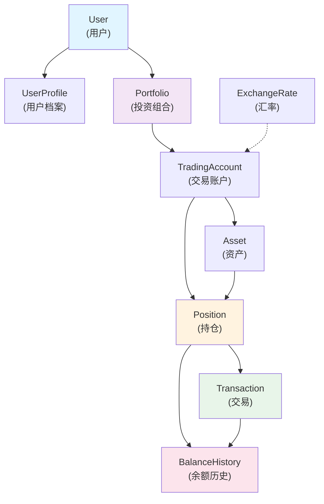

# FinApp 数据结构设计文档

**文档版本**: v1.0  
**最后更新**: 2025-11-23  
**作者**: FinApp 开发团队  
**适用版本**: FinApp 1.0+

---

## 目录

1. [系统架构概述](#系统架构概述)
2. [用户认证与权限](#用户认证与权限)
3. [投资组合管理](#投资组合管理)
4. [资产与交易](#资产与交易)
5. [余额历史与现金流](#余额历史与现金流)
6. [价格数据与同步](#价格数据与同步)
7. [财务分析与报告](#财务分析与报告)
8. [标签与分类系统](#标签与分类系统)
9. [专业产品详情](#专业产品详情)
10. [审计与日志](#审计与日志)
11. [性能优化策略](#性能优化策略)

---

## 系统架构概述

### 设计原则

FinApp 数据结构遵循以下核心原则：

| 原则 | 描述 |
|------|------|
| **多层架构** | User → Portfolio → TradingAccount → Position → Transaction → BalanceHistory |
| **多资产支持** | 股票、基金、ETF、理财产品、期权、加密货币等 |
| **多币种支持** | 实时汇率转换、多币种计算、风险管理 |
| **审计完整性** | 所有重要操作都有审计日志，支持数据追溯 |
| **性能优化** | 复合索引、物化视图、缓存策略、查询优化 |
| **数据一致性** | 外键约束、触发器、事务管理 |

### 核心实体关系



### 多层架构详解

#### 第一层：User（用户层）
- 存储用户基本身份信息
- 关联用户认证和授权
- 关联用户档案详情

#### 第二层：Portfolio（投资组合层）
- 用户可以创建多个投资组合
- 每个组合独立管理和计算
- 支持组合级别的性能分析

#### 第三层：TradingAccount（交易账户层）
- 每个组合下可以有多个交易账户
- 账户绑定具体交易所/银行/产品
- 账户级别的同步和对账

#### 第四层：Position（持仓层）
- 记录账户中具体的资产持仓
- 支持多种资产类型（股票、基金、理财等）
- 持仓级别的余额历史跟踪

#### 第五层：Transaction（交易层）
- 记录每笔具体交易操作
- 支持多种交易类型（买、卖、分红、手续费等）
- 交易时间精确到秒级

#### 第六层：BalanceHistory（历史层）
- 记录每次余额变化的历史
- 支持数据追溯和性能分析
- 自动计算变化金额

---

## 用户认证与权限

### Users 表

用户核心身份表，存储登录相关信息。

```sql
CREATE TABLE finapp.users (
    id UUID PRIMARY KEY DEFAULT gen_random_uuid(),
    email VARCHAR(255) UNIQUE NOT NULL,
    username VARCHAR(100) UNIQUE NOT NULL,
    password_hash VARCHAR(255) NOT NULL,
    is_active BOOLEAN DEFAULT true NOT NULL,
    last_login_at TIMESTAMP WITH TIME ZONE,
    created_at TIMESTAMP WITH TIME ZONE DEFAULT CURRENT_TIMESTAMP,
    updated_at TIMESTAMP WITH TIME ZONE DEFAULT CURRENT_TIMESTAMP,
    deleted_at TIMESTAMP WITH TIME ZONE
);

-- 索引
CREATE INDEX idx_users_email ON finapp.users(email);
CREATE INDEX idx_users_username ON finapp.users(username);
CREATE INDEX idx_users_is_active ON finapp.users(is_active) WHERE is_active = true;
```

**关键字段说明**：
- `id`: UUID 主键，确保全局唯一性
- `email`: 唯一邮箱，用于登录和通知
- `username`: 唯一用户名，用于展示
- `password_hash`: 加密后的密码，使用 bcrypt 或 argon2
- `is_active`: 账户激活状态，支持软删除
- `last_login_at`: 最后登录时间，用于安全审计
- `deleted_at`: 软删除时间戳，支持数据恢复

### UserProfile 表

用户档案表，存储用户详细信息。

```sql
CREATE TABLE finapp.user_profiles (
    id UUID PRIMARY KEY DEFAULT gen_random_uuid(),
    user_id UUID NOT NULL UNIQUE REFERENCES finapp.users(id) ON DELETE CASCADE,
    first_name VARCHAR(100),
    last_name VARCHAR(100),
    phone_number VARCHAR(20),
    date_of_birth DATE,
    gender VARCHAR(10),
    country VARCHAR(100),
    timezone VARCHAR(50) DEFAULT 'UTC',
    currency_preference VARCHAR(3) DEFAULT 'USD',
    notification_preference JSONB DEFAULT '{"email": true, "sms": false}',
    created_at TIMESTAMP WITH TIME ZONE DEFAULT CURRENT_TIMESTAMP,
    updated_at TIMESTAMP WITH TIME ZONE DEFAULT CURRENT_TIMESTAMP
);

CREATE INDEX idx_user_profiles_user_id ON finapp.user_profiles(user_id);
```

### UserSession 表

用户会话管理表，支持多设备登录。

```sql
CREATE TABLE finapp.user_sessions (
    id UUID PRIMARY KEY DEFAULT gen_random_uuid(),
    user_id UUID NOT NULL REFERENCES finapp.users(id) ON DELETE CASCADE,
    token_hash VARCHAR(255) NOT NULL,
    ip_address VARCHAR(45),
    user_agent TEXT,
    expires_at TIMESTAMP WITH TIME ZONE NOT NULL,
    created_at TIMESTAMP WITH TIME ZONE DEFAULT CURRENT_TIMESTAMP,
    revoked_at TIMESTAMP WITH TIME ZONE
);

CREATE INDEX idx_user_sessions_user_id ON finapp.user_sessions(user_id);
CREATE INDEX idx_user_sessions_token_hash ON finapp.user_sessions(token_hash);
CREATE INDEX idx_user_sessions_expires_at ON finapp.user_sessions(expires_at);
```

### Roles 表

角色管理表。

```sql
CREATE TABLE finapp.roles (
    id UUID PRIMARY KEY DEFAULT gen_random_uuid(),
    name VARCHAR(50) UNIQUE NOT NULL,
    description TEXT,
    created_at TIMESTAMP WITH TIME ZONE DEFAULT CURRENT_TIMESTAMP
);

INSERT INTO finapp.roles (name, description) VALUES
    ('ADMIN', '系统管理员'),
    ('USER', '普通用户'),
    ('PREMIUM', '高级用户'),
    ('ANALYST', '分析师');
```

### Permissions 表

权限表。

```sql
CREATE TABLE finapp.permissions (
    id UUID PRIMARY KEY DEFAULT gen_random_uuid(),
    name VARCHAR(100) UNIQUE NOT NULL,
    description TEXT,
    created_at TIMESTAMP WITH TIME ZONE DEFAULT CURRENT_TIMESTAMP
);

INSERT INTO finapp.permissions (name, description) VALUES
    ('CREATE_PORTFOLIO', '创建投资组合'),
    ('EDIT_PORTFOLIO', '编辑投资组合'),
    ('DELETE_PORTFOLIO', '删除投资组合'),
    ('VIEW_ANALYTICS', '查看分析数据'),
    ('MANAGE_USERS', '管理用户');
```

### UserPermissions 表

用户权限关联表。

```sql
CREATE TABLE finapp.user_permissions (
    id UUID PRIMARY KEY DEFAULT gen_random_uuid(),
    user_id UUID NOT NULL REFERENCES finapp.users(id) ON DELETE CASCADE,
    permission_id UUID NOT NULL REFERENCES finapp.permissions(id) ON DELETE CASCADE,
    granted_at TIMESTAMP WITH TIME ZONE DEFAULT CURRENT_TIMESTAMP,
    granted_by UUID REFERENCES finapp.users(id),
    UNIQUE(user_id, permission_id)
);

CREATE INDEX idx_user_permissions_user_id ON finapp.user_permissions(user_id);
```

---

## 投资组合管理

### Portfolios 表

投资组合核心表，支持用户创建多个投资组合。

```sql
CREATE TABLE finapp.portfolios (
    id UUID PRIMARY KEY DEFAULT gen_random_uuid(),
    user_id UUID NOT NULL REFERENCES finapp.users(id) ON DELETE CASCADE,
    name VARCHAR(255) NOT NULL,
    description TEXT,
    base_currency VARCHAR(3) DEFAULT 'USD' NOT NULL,
    is_default BOOLEAN DEFAULT false,
    is_active BOOLEAN DEFAULT true,
    portfolio_type VARCHAR(50) DEFAULT 'MIXED',
    -- 投资组合类型: MIXED(混合), STOCKS(股票), FUNDS(基金), FIXED_INCOME(固定收益), etc.
    risk_level VARCHAR(20),
    -- 风险等级: LOW, MEDIUM, HIGH
    rebalance_frequency VARCHAR(20),
    -- 重新平衡频率: MONTHLY, QUARTERLY, ANNUALLY, MANUAL
    created_at TIMESTAMP WITH TIME ZONE DEFAULT CURRENT_TIMESTAMP,
    updated_at TIMESTAMP WITH TIME ZONE DEFAULT CURRENT_TIMESTAMP,
    UNIQUE(user_id, name)
);

-- 索引
CREATE INDEX idx_portfolios_user_id ON finapp.portfolios(user_id);
CREATE INDEX idx_portfolios_is_active ON finapp.portfolios(is_active) WHERE is_active = true;
```

**关键字段**：
- `base_currency`: 投资组合的基础货币，所有计算和展示都基于此货币
- `portfolio_type`: 投资组合的类型分类，支持过滤和分析
- `risk_level`: 风险等级，用于风险管理和建议
- `rebalance_frequency`: 再平衡频率，用于自动化策略

### TradingAccounts 表

交易账户表，绑定具体的交易渠道。

```sql
CREATE TABLE finapp.trading_accounts (
    id UUID PRIMARY KEY DEFAULT gen_random_uuid(),
    portfolio_id UUID NOT NULL REFERENCES finapp.portfolios(id) ON DELETE CASCADE,
    account_name VARCHAR(255) NOT NULL,
    account_type VARCHAR(50) NOT NULL,
    -- 账户类型: BROKERAGE(券商), BANK(银行), WEALTH_MGMT(财富管理), CRYPTO(加密货币), etc.
    account_number VARCHAR(100),
    institution VARCHAR(255),
    -- 金融机构名称
    currency VARCHAR(3) DEFAULT 'USD' NOT NULL,
    is_active BOOLEAN DEFAULT true,
    sync_enabled BOOLEAN DEFAULT false,
    last_synced_at TIMESTAMP WITH TIME ZONE,
    connection_status VARCHAR(20) DEFAULT 'PENDING',
    -- PENDING, CONNECTED, ERROR, DISCONNECTED
    metadata JSONB,
    -- 存储账户特定的元数据
    created_at TIMESTAMP WITH TIME ZONE DEFAULT CURRENT_TIMESTAMP,
    updated_at TIMESTAMP WITH TIME ZONE DEFAULT CURRENT_TIMESTAMP,
    UNIQUE(portfolio_id, account_number)
);

-- 索引
CREATE INDEX idx_trading_accounts_portfolio_id ON finapp.trading_accounts(portfolio_id);
CREATE INDEX idx_trading_accounts_is_active ON finapp.trading_accounts(is_active) WHERE is_active = true;
```

---

## 资产与交易

### Assets 表

资产主表，定义系统支持的所有资产。

```sql
CREATE TABLE finapp.assets (
    id UUID PRIMARY KEY DEFAULT gen_random_uuid(),
    asset_code VARCHAR(50) UNIQUE NOT NULL,
    -- 资产代码: AAPL, 000001.SZ, etc.
    asset_name VARCHAR(255) NOT NULL,
    asset_type VARCHAR(50) NOT NULL,
    -- 资产类型: STOCK, FUND, ETF, BOND, COMMODITY, CRYPTO, etc.
    currency VARCHAR(3) DEFAULT 'USD',
    exchange VARCHAR(100),
    -- 交易所: NASDAQ, NYSE, SSE, etc.
    country VARCHAR(100),
    sector VARCHAR(100),
    -- 行业分类
    industry VARCHAR(100),
    description TEXT,
    is_active BOOLEAN DEFAULT true,
    created_at TIMESTAMP WITH TIME ZONE DEFAULT CURRENT_TIMESTAMP,
    updated_at TIMESTAMP WITH TIME ZONE DEFAULT CURRENT_TIMESTAMP
);

-- 索引
CREATE INDEX idx_assets_asset_code ON finapp.assets(asset_code);
CREATE INDEX idx_assets_asset_type ON finapp.assets(asset_type);
CREATE INDEX idx_assets_exchange ON finapp.assets(exchange);
```

### Positions 表

持仓表，记录账户中的资产持仓。

```sql
CREATE TABLE finapp.positions (
    id UUID PRIMARY KEY DEFAULT gen_random_uuid(),
    portfolio_id UUID NOT NULL REFERENCES finapp.portfolios(id) ON DELETE CASCADE,
    trading_account_id UUID NOT NULL REFERENCES finapp.trading_accounts(id) ON DELETE CASCADE,
    asset_id UUID NOT NULL REFERENCES finapp.assets(id) ON DELETE RESTRICT,
    quantity DECIMAL(15, 8) NOT NULL DEFAULT 0,
    -- 持仓数量
    average_cost DECIMAL(15, 8),
    -- 平均成本
    cost_basis DECIMAL(15, 8),
    -- 成本基础（总成本）
    current_price DECIMAL(15, 8),
    -- 当前价格
    market_value DECIMAL(15, 8),
    -- 市场价值（数量 × 当前价格）
    gain_loss DECIMAL(15, 8),
    -- 浮动盈亏
    gain_loss_percent DECIMAL(5, 2),
    -- 浮动盈亏百分比
    opened_at DATE,
    -- 开仓日期
    closed_at DATE,
    is_active BOOLEAN DEFAULT true,
    position_status VARCHAR(20) DEFAULT 'OPEN',
    -- OPEN(开仓), CLOSED(平仓), PARTIAL(部分平仓)
    created_at TIMESTAMP WITH TIME ZONE DEFAULT CURRENT_TIMESTAMP,
    updated_at TIMESTAMP WITH TIME ZONE DEFAULT CURRENT_TIMESTAMP,
    UNIQUE(portfolio_id, trading_account_id, asset_id)
    -- 确保同一账户下同一资产只有一条持仓记录
);

-- 索引
CREATE INDEX idx_positions_portfolio_id ON finapp.positions(portfolio_id);
CREATE INDEX idx_positions_trading_account_id ON finapp.positions(trading_account_id);
CREATE INDEX idx_positions_asset_id ON finapp.positions(asset_id);
CREATE INDEX idx_positions_is_active ON finapp.positions(is_active) WHERE is_active = true;
```

**关键约束**：
- `UNIQUE(portfolio_id, trading_account_id, asset_id)`: 三元组唯一约束，确保同一账户下同一资产只有一个持仓记录

### Transactions 表

交易记录表，记录所有交易操作。

```sql
CREATE TABLE finapp.transactions (
    id UUID PRIMARY KEY DEFAULT gen_random_uuid(),
    position_id UUID NOT NULL REFERENCES finapp.positions(id) ON DELETE RESTRICT,
    transaction_type VARCHAR(50) NOT NULL,
    -- 交易类型: BUY(买), SELL(卖), DIVIDEND(分红), INTEREST(利息), FEE(手续费), SPLIT(拆分), BONUS(红利)
    side VARCHAR(10),
    -- BUY 或 SELL
    quantity DECIMAL(15, 8) NOT NULL,
    unit_price DECIMAL(15, 8) NOT NULL,
    amount DECIMAL(15, 8) NOT NULL,
    -- 交易金额（数量 × 单价）
    commission DECIMAL(15, 8) DEFAULT 0,
    -- 手续费
    tax DECIMAL(15, 8) DEFAULT 0,
    -- 税费
    net_amount DECIMAL(15, 8),
    -- 净额（金额 - 手续费 - 税费）
    transaction_date DATE NOT NULL,
    -- 交易日期
    executed_at TIMESTAMP WITH TIME ZONE NOT NULL,
    -- 执行时间，精确到秒
    notes TEXT,
    -- 备注
    created_at TIMESTAMP WITH TIME ZONE DEFAULT CURRENT_TIMESTAMP,
    updated_at TIMESTAMP WITH TIME ZONE DEFAULT CURRENT_TIMESTAMP
);

-- 索引
CREATE INDEX idx_transactions_position_id ON finapp.transactions(position_id);
CREATE INDEX idx_transactions_transaction_date ON finapp.transactions(transaction_date);
CREATE INDEX idx_transactions_executed_at ON finapp.transactions(executed_at);
CREATE INDEX idx_transactions_type ON finapp.transactions(transaction_type);
```

---

## 余额历史与现金流

### BalanceHistory 表

余额历史表，记录每次余额变化。

```sql
CREATE TABLE finapp.balance_history (
    id UUID PRIMARY KEY DEFAULT gen_random_uuid(),
    position_id UUID NOT NULL REFERENCES finapp.positions(id) ON DELETE CASCADE,
    balance DECIMAL(15, 8) NOT NULL,
    -- 当前余额
    previous_balance DECIMAL(15, 8),
    -- 前一次余额
    change_amount DECIMAL(15, 8) GENERATED ALWAYS AS 
        (balance - COALESCE(previous_balance, balance)) STORED,
    -- 变化金额，自动计算
    change_type VARCHAR(20) NOT NULL,
    -- 变化类型: TRANSACTION(交易), INTEREST(利息), DIVIDEND(分红), FEE(手续费), MANUAL_UPDATE(手动更新)
    update_date DATE NOT NULL,
    -- 更新日期
    update_time TIMESTAMP WITH TIME ZONE NOT NULL,
    -- 更新时间，精确到秒
    description TEXT,
    -- 描述
    created_at TIMESTAMP WITH TIME ZONE DEFAULT CURRENT_TIMESTAMP
);

-- 索引
CREATE INDEX idx_balance_history_position_id ON finapp.balance_history(position_id);
CREATE INDEX idx_balance_history_update_date ON finapp.balance_history(update_date);
CREATE INDEX idx_balance_history_change_type ON finapp.balance_history(change_type);
```

**特点**：
- `change_amount`: 使用 GENERATED ALWAYS AS STORED 列，自动计算变化金额，避免手动更新错误
- `update_date` 和 `update_time` 分离，支持按日期快速查询和按时间精确查询
- `change_type` 支持多种变化类型，方便分析和过滤

### 余额历史重建逻辑

基于交易记录重建余额历史的核心逻辑：

```sql
-- 1. 基于交易生成累计余额
WITH transaction_timeline AS (
    SELECT 
        position_id,
        transaction_date,
        executed_at,
        SUM(CASE WHEN side = 'BUY' THEN quantity ELSE -quantity END) 
            OVER (PARTITION BY position_id ORDER BY transaction_date ASC, executed_at ASC) as running_balance,
        ROW_NUMBER() OVER (PARTITION BY position_id ORDER BY transaction_date ASC, executed_at ASC) as rn
    FROM finapp.transactions
    WHERE position_id = $1
)
-- 2. 计算前一次余额
, with_previous AS (
    SELECT 
        position_id,
        running_balance as balance,
        LAG(running_balance) OVER (PARTITION BY position_id ORDER BY rn) as previous_balance,
        transaction_date as update_date,
        executed_at as update_time,
        'TRANSACTION' as change_type
    FROM transaction_timeline
)
-- 3. 插入历史记录
INSERT INTO finapp.balance_history (position_id, balance, previous_balance, change_type, update_date, update_time)
SELECT 
    position_id, 
    balance, 
    previous_balance, 
    change_type, 
    update_date, 
    update_time
FROM with_previous
WHERE balance IS NOT NULL;
```

### CashFlows 表

现金流表，记录账户的资金进出。

```sql
CREATE TABLE finapp.cash_flows (
    id UUID PRIMARY KEY DEFAULT gen_random_uuid(),
    trading_account_id UUID NOT NULL REFERENCES finapp.trading_accounts(id) ON DELETE CASCADE,
    flow_type VARCHAR(50) NOT NULL,
    -- DEPOSIT(入金), WITHDRAWAL(出金), DIVIDEND(分红), INTEREST(利息), FEE(手续费)
    amount DECIMAL(15, 8) NOT NULL,
    currency VARCHAR(3) DEFAULT 'USD',
    flow_date DATE NOT NULL,
    flow_time TIMESTAMP WITH TIME ZONE NOT NULL,
    description TEXT,
    reference_id UUID,
    -- 关联的交易 ID
    created_at TIMESTAMP WITH TIME ZONE DEFAULT CURRENT_TIMESTAMP
);

-- 索引
CREATE INDEX idx_cash_flows_trading_account_id ON finapp.cash_flows(trading_account_id);
CREATE INDEX idx_cash_flows_flow_date ON finapp.cash_flows(flow_date);
CREATE INDEX idx_cash_flows_flow_type ON finapp.cash_flows(flow_type);
```

### MultiCurrencyCash 表

多币种现金表，记录账户中不同币种的现金余额。

```sql
CREATE TABLE finapp.multi_currency_cash (
    id UUID PRIMARY KEY DEFAULT gen_random_uuid(),
    trading_account_id UUID NOT NULL REFERENCES finapp.trading_accounts(id) ON DELETE CASCADE,
    currency VARCHAR(3) NOT NULL,
    available_balance DECIMAL(15, 8) DEFAULT 0,
    frozen_balance DECIMAL(15, 8) DEFAULT 0,
    total_balance DECIMAL(15, 8) GENERATED ALWAYS AS 
        (available_balance + frozen_balance) STORED,
    last_update TIMESTAMP WITH TIME ZONE DEFAULT CURRENT_TIMESTAMP,
    created_at TIMESTAMP WITH TIME ZONE DEFAULT CURRENT_TIMESTAMP,
    UNIQUE(trading_account_id, currency)
);

-- 索引
CREATE INDEX idx_multi_currency_cash_trading_account_id ON finapp.multi_currency_cash(trading_account_id);
```

---

## 价格数据与同步

### AssetPrices 表

资产价格历史表，记录资产的历史价格。

```sql
CREATE TABLE finapp.asset_prices (
    id UUID PRIMARY KEY DEFAULT gen_random_uuid(),
    asset_id UUID NOT NULL REFERENCES finapp.assets(id) ON DELETE CASCADE,
    price DECIMAL(15, 8) NOT NULL,
    price_date DATE NOT NULL,
    price_time TIMESTAMP WITH TIME ZONE,
    price_source VARCHAR(100),
    -- 数据源: YAHOO_FINANCE, ALPHA_VANTAGE, LOCAL_ENTRY, etc.
    is_current BOOLEAN DEFAULT false,
    -- 标记是否为当前价格
    created_at TIMESTAMP WITH TIME ZONE DEFAULT CURRENT_TIMESTAMP,
    UNIQUE(asset_id, price_date)
);

-- 索引
CREATE INDEX idx_asset_prices_asset_id ON finapp.asset_prices(asset_id);
CREATE INDEX idx_asset_prices_price_date ON finapp.asset_prices(price_date);
CREATE INDEX idx_asset_prices_is_current ON finapp.asset_prices(is_current) WHERE is_current = true;
```

### ExchangeRates 表

汇率表，支持多币种转换。

```sql
CREATE TABLE finapp.exchange_rates (
    id UUID PRIMARY KEY DEFAULT gen_random_uuid(),
    from_currency VARCHAR(3) NOT NULL,
    to_currency VARCHAR(3) NOT NULL,
    rate DECIMAL(15, 8) NOT NULL,
    rate_date DATE NOT NULL,
    rate_time TIMESTAMP WITH TIME ZONE NOT NULL,
    source VARCHAR(100),
    -- 数据源: ECB, YAHOO, FIXERIO, etc.
    is_active BOOLEAN DEFAULT true,
    created_at TIMESTAMP WITH TIME ZONE DEFAULT CURRENT_TIMESTAMP,
    updated_at TIMESTAMP WITH TIME ZONE DEFAULT CURRENT_TIMESTAMP,
    UNIQUE(from_currency, to_currency, rate_date)
);

-- 索引
CREATE INDEX idx_exchange_rates_currencies ON finapp.exchange_rates(from_currency, to_currency);
CREATE INDEX idx_exchange_rates_date ON finapp.exchange_rates(rate_date);
CREATE INDEX idx_exchange_rates_is_active ON finapp.exchange_rates(is_active) WHERE is_active = true;
```

### SyncLogs 表

数据同步日志表，记录数据同步的历史。

```sql
CREATE TABLE finapp.sync_logs (
    id UUID PRIMARY KEY DEFAULT gen_random_uuid(),
    trading_account_id UUID REFERENCES finapp.trading_accounts(id) ON DELETE SET NULL,
    sync_type VARCHAR(50) NOT NULL,
    -- PRICE_UPDATE, EXCHANGE_RATE_UPDATE, TRANSACTION_SYNC, BALANCE_SYNC
    status VARCHAR(20) NOT NULL,
    -- PENDING, IN_PROGRESS, SUCCESS, FAILED
    records_processed INT,
    records_failed INT,
    error_message TEXT,
    started_at TIMESTAMP WITH TIME ZONE NOT NULL,
    completed_at TIMESTAMP WITH TIME ZONE,
    created_at TIMESTAMP WITH TIME ZONE DEFAULT CURRENT_TIMESTAMP
);

-- 索引
CREATE INDEX idx_sync_logs_trading_account_id ON finapp.sync_logs(trading_account_id);
CREATE INDEX idx_sync_logs_sync_type ON finapp.sync_logs(sync_type);
CREATE INDEX idx_sync_logs_status ON finapp.sync_logs(status);
```

---

## 财务分析与报告

### PerformanceMetrics 表

性能指标表，存储计算得到的性能指标。

```sql
CREATE TABLE finapp.performance_metrics (
    id UUID PRIMARY KEY DEFAULT gen_random_uuid(),
    portfolio_id UUID NOT NULL REFERENCES finapp.portfolios(id) ON DELETE CASCADE,
    metric_date DATE NOT NULL,
    total_return DECIMAL(5, 2),
    -- 总回报率，百分比
    ytd_return DECIMAL(5, 2),
    -- 年初至今回报率
    one_month_return DECIMAL(5, 2),
    three_month_return DECIMAL(5, 2),
    one_year_return DECIMAL(5, 2),
    inception_return DECIMAL(5, 2),
    -- 成立以来回报率
    sharpe_ratio DECIMAL(6, 3),
    -- 夏普比率
    sortino_ratio DECIMAL(6, 3),
    -- 索提诺比率
    max_drawdown DECIMAL(5, 2),
    -- 最大回撤
    volatility DECIMAL(5, 2),
    -- 波动率
    benchmark_name VARCHAR(100),
    benchmark_return DECIMAL(5, 2),
    tracking_error DECIMAL(5, 2),
    created_at TIMESTAMP WITH TIME ZONE DEFAULT CURRENT_TIMESTAMP,
    UNIQUE(portfolio_id, metric_date)
);

-- 索引
CREATE INDEX idx_performance_metrics_portfolio_id ON finapp.performance_metrics(portfolio_id);
CREATE INDEX idx_performance_metrics_metric_date ON finapp.performance_metrics(metric_date);
```

### PortfolioSnapshots 表

投资组合快照表，记录特定时间点的投资组合状态。

```sql
CREATE TABLE finapp.portfolio_snapshots (
    id UUID PRIMARY KEY DEFAULT gen_random_uuid(),
    portfolio_id UUID NOT NULL REFERENCES finapp.portfolios(id) ON DELETE CASCADE,
    snapshot_date DATE NOT NULL,
    total_market_value DECIMAL(15, 8) NOT NULL,
    total_cost_basis DECIMAL(15, 8),
    total_gain_loss DECIMAL(15, 8),
    total_gain_loss_percent DECIMAL(5, 2),
    position_count INT,
    holding_count INT,
    snapshot_data JSONB,
    -- 快照时的详细数据
    created_at TIMESTAMP WITH TIME ZONE DEFAULT CURRENT_TIMESTAMP,
    UNIQUE(portfolio_id, snapshot_date)
);

-- 索引
CREATE INDEX idx_portfolio_snapshots_portfolio_id ON finapp.portfolio_snapshots(portfolio_id);
CREATE INDEX idx_portfolio_snapshots_snapshot_date ON finapp.portfolio_snapshots(snapshot_date);
```

### PositionSnapshots 表

持仓快照表，记录特定时间点的持仓状态。

```sql
CREATE TABLE finapp.position_snapshots (
    id UUID PRIMARY KEY DEFAULT gen_random_uuid(),
    position_id UUID NOT NULL REFERENCES finapp.positions(id) ON DELETE CASCADE,
    snapshot_date DATE NOT NULL,
    quantity DECIMAL(15, 8),
    average_cost DECIMAL(15, 8),
    cost_basis DECIMAL(15, 8),
    current_price DECIMAL(15, 8),
    market_value DECIMAL(15, 8),
    gain_loss DECIMAL(15, 8),
    gain_loss_percent DECIMAL(5, 2),
    snapshot_data JSONB,
    created_at TIMESTAMP WITH TIME ZONE DEFAULT CURRENT_TIMESTAMP,
    UNIQUE(position_id, snapshot_date)
);

-- 索引
CREATE INDEX idx_position_snapshots_position_id ON finapp.position_snapshots(position_id);
CREATE INDEX idx_position_snapshots_snapshot_date ON finapp.position_snapshots(snapshot_date);
```

---

## 标签与分类系统

### TagCategories 表

标签分类表。

```sql
CREATE TABLE finapp.tag_categories (
    id UUID PRIMARY KEY DEFAULT gen_random_uuid(),
    user_id UUID NOT NULL REFERENCES finapp.users(id) ON DELETE CASCADE,
    category_name VARCHAR(100) NOT NULL,
    description TEXT,
    color VARCHAR(7),
    -- 16进制颜色代码，如 #FF0000
    icon VARCHAR(50),
    created_at TIMESTAMP WITH TIME ZONE DEFAULT CURRENT_TIMESTAMP,
    UNIQUE(user_id, category_name)
);
```

### Tags 表

标签表。

```sql
CREATE TABLE finapp.tags (
    id UUID PRIMARY KEY DEFAULT gen_random_uuid(),
    category_id UUID NOT NULL REFERENCES finapp.tag_categories(id) ON DELETE CASCADE,
    tag_name VARCHAR(100) NOT NULL,
    description TEXT,
    created_at TIMESTAMP WITH TIME ZONE DEFAULT CURRENT_TIMESTAMP,
    UNIQUE(category_id, tag_name)
);
```

### AssetTags 表

资产标签关联表。

```sql
CREATE TABLE finapp.asset_tags (
    id UUID PRIMARY KEY DEFAULT gen_random_uuid(),
    asset_id UUID NOT NULL REFERENCES finapp.assets(id) ON DELETE CASCADE,
    tag_id UUID NOT NULL REFERENCES finapp.tags(id) ON DELETE CASCADE,
    created_at TIMESTAMP WITH TIME ZONE DEFAULT CURRENT_TIMESTAMP,
    UNIQUE(asset_id, tag_id)
);
```

---

## 专业产品详情

### StockDetails 表

股票详情表。

```sql
CREATE TABLE finapp.stock_details (
    id UUID PRIMARY KEY DEFAULT gen_random_uuid(),
    asset_id UUID NOT NULL UNIQUE REFERENCES finapp.assets(id) ON DELETE CASCADE,
    symbol VARCHAR(20),
    company_name VARCHAR(255),
    isin_code VARCHAR(20),
    cusip_code VARCHAR(20),
    sector VARCHAR(100),
    industry VARCHAR(100),
    market_cap DECIMAL(20, 2),
    dividend_yield DECIMAL(5, 2),
    pe_ratio DECIMAL(10, 2),
    -- 市盈率
    eps DECIMAL(10, 2),
    -- 每股收益
    book_value_per_share DECIMAL(10, 2),
    employees INT,
    founded_year INT,
    website VARCHAR(255),
    created_at TIMESTAMP WITH TIME ZONE DEFAULT CURRENT_TIMESTAMP,
    updated_at TIMESTAMP WITH TIME ZONE DEFAULT CURRENT_TIMESTAMP
);
```

### FundDetails 表

基金详情表。

```sql
CREATE TABLE finapp.fund_details (
    id UUID PRIMARY KEY DEFAULT gen_random_uuid(),
    asset_id UUID NOT NULL UNIQUE REFERENCES finapp.assets(id) ON DELETE CASCADE,
    fund_code VARCHAR(20),
    fund_type VARCHAR(50),
    -- ETF, MUTUAL_FUND, INDEX_FUND, etc.
    management_company VARCHAR(255),
    inception_date DATE,
    net_asset_value DECIMAL(15, 8),
    expense_ratio DECIMAL(5, 3),
    -- 费用率，百分比
    turnover_ratio DECIMAL(5, 2),
    -- 换手率
    year_high DECIMAL(15, 8),
    year_low DECIMAL(15, 8),
    fifty_two_week_high DECIMAL(15, 8),
    fifty_two_week_low DECIMAL(15, 8),
    benchmark_index VARCHAR(100),
    created_at TIMESTAMP WITH TIME ZONE DEFAULT CURRENT_TIMESTAMP,
    updated_at TIMESTAMP WITH TIME ZONE DEFAULT CURRENT_TIMESTAMP
);
```

### WealthProductDetails 表

理财产品详情表。

```sql
CREATE TABLE finapp.wealth_product_details (
    id UUID PRIMARY KEY DEFAULT gen_random_uuid(),
    asset_id UUID NOT NULL UNIQUE REFERENCES finapp.assets(id) ON DELETE CASCADE,
    product_code VARCHAR(50),
    issuer VARCHAR(255),
    product_type VARCHAR(50),
    -- MONEY_MARKET, FIXED_INCOME, STRUCTURED, etc.
    issue_date DATE,
    maturity_date DATE,
    expected_return DECIMAL(5, 2),
    -- 预期收益率
    annual_coupon_rate DECIMAL(5, 3),
    -- 年息票率
    credit_rating VARCHAR(20),
    -- 信用评级: AAA, AA, A, BBB, etc.
    minimum_investment DECIMAL(15, 2),
    investment_period VARCHAR(50),
    created_at TIMESTAMP WITH TIME ZONE DEFAULT CURRENT_TIMESTAMP,
    updated_at TIMESTAMP WITH TIME ZONE DEFAULT CURRENT_TIMESTAMP
);
```

### StockOptionDetails 表

期权详情表。

```sql
CREATE TABLE finapp.stock_option_details (
    id UUID PRIMARY KEY DEFAULT gen_random_uuid(),
    asset_id UUID NOT NULL UNIQUE REFERENCES finapp.assets(id) ON DELETE CASCADE,
    underlying_asset_id UUID REFERENCES finapp.assets(id),
    option_type VARCHAR(10),
    -- CALL 或 PUT
    strike_price DECIMAL(15, 8),
    expiration_date DATE,
    contract_multiplier INT,
    implied_volatility DECIMAL(5, 2),
    delta DECIMAL(5, 3),
    gamma DECIMAL(5, 4),
    theta DECIMAL(5, 3),
    vega DECIMAL(5, 3),
    rho DECIMAL(5, 3),
    created_at TIMESTAMP WITH TIME ZONE DEFAULT CURRENT_TIMESTAMP,
    updated_at TIMESTAMP WITH TIME ZONE DEFAULT CURRENT_TIMESTAMP
);
```

---

## 审计与日志

### AuditLogs 表

审计日志表，记录所有重要操作。

```sql
CREATE TABLE finapp.audit_logs (
    id UUID PRIMARY KEY DEFAULT gen_random_uuid(),
    user_id UUID REFERENCES finapp.users(id) ON DELETE SET NULL,
    entity_type VARCHAR(50) NOT NULL,
    -- PORTFOLIO, TRANSACTION, POSITION, etc.
    entity_id UUID,
    action VARCHAR(50) NOT NULL,
    -- CREATE, UPDATE, DELETE, EXPORT, etc.
    old_values JSONB,
    new_values JSONB,
    change_summary TEXT,
    ip_address VARCHAR(45),
    user_agent TEXT,
    status VARCHAR(20),
    -- SUCCESS, FAILED
    error_message TEXT,
    created_at TIMESTAMP WITH TIME ZONE DEFAULT CURRENT_TIMESTAMP
);

-- 索引
CREATE INDEX idx_audit_logs_user_id ON finapp.audit_logs(user_id);
CREATE INDEX idx_audit_logs_entity_type ON finapp.audit_logs(entity_type);
CREATE INDEX idx_audit_logs_action ON finapp.audit_logs(action);
CREATE INDEX idx_audit_logs_created_at ON finapp.audit_logs(created_at);
```

---

## 性能优化策略

### 索引策略

#### 1. 复合索引

```sql
-- 用户-投资组合查询优化
CREATE INDEX idx_portfolios_user_active ON finapp.portfolios(user_id, is_active);

-- 交易日期范围查询优化
CREATE INDEX idx_transactions_position_date ON finapp.transactions(position_id, transaction_date DESC);

-- 余额历史查询优化
CREATE INDEX idx_balance_history_position_date ON finapp.balance_history(position_id, update_date DESC);

-- 多币种现金查询
CREATE INDEX idx_multi_currency_cash_account_currency ON finapp.multi_currency_cash(trading_account_id, currency);

-- 持仓活跃状态查询
CREATE INDEX idx_positions_portfolio_active ON finapp.positions(portfolio_id, is_active) 
    WHERE is_active = true;
```

#### 2. 部分索引

```sql
-- 仅索引活跃用户
CREATE INDEX idx_users_active_email ON finapp.users(email) 
    WHERE is_active = true;

-- 仅索引未关闭的持仓
CREATE INDEX idx_positions_open ON finapp.positions(portfolio_id) 
    WHERE is_active = true AND position_status = 'OPEN';

-- 仅索引当前价格
CREATE INDEX idx_asset_prices_current ON finapp.asset_prices(asset_id) 
    WHERE is_current = true;
```

### 查询优化建议

#### 1. 避免 N+1 查询问题

```typescript
// ❌ 错误：N+1 查询
const positions = await db.positions.findMany({ where: { portfolio_id } });
for (const position of positions) {
    const balanceHistory = await db.balanceHistory.findMany({ 
        where: { position_id: position.id } 
    });
}

// ✅ 正确：使用 JOIN 一次查询
const positions = await db.positions.findMany({
    where: { portfolio_id },
    include: { balanceHistory: true }
});
```

#### 2. 日期范围查询优化

```sql
-- ✅ 使用索引的范围查询
SELECT * FROM finapp.balance_history
WHERE position_id = $1 
    AND update_date BETWEEN $2 AND $3
ORDER BY update_date DESC;
```

#### 3. 聚合查询优化

```sql
-- ❌ 低效：全表扫描后分组
SELECT position_id, SUM(quantity) as total
FROM finapp.transactions
GROUP BY position_id;

-- ✅ 优化：使用持仓表中缓存的值
SELECT id, quantity
FROM finapp.positions
WHERE portfolio_id = $1;
```

### 物化视图策略

#### 投资组合性能视图

```sql
CREATE MATERIALIZED VIEW finapp.portfolio_performance_view AS
SELECT 
    p.id as portfolio_id,
    COUNT(DISTINCT pos.id) as position_count,
    SUM(pos.market_value) as total_market_value,
    SUM(pos.cost_basis) as total_cost_basis,
    SUM(pos.gain_loss) as total_gain_loss,
    ROUND(100.0 * SUM(pos.gain_loss) / SUM(pos.cost_basis), 2) as total_return_percent,
    MAX(bh.update_date) as last_update_date
FROM finapp.portfolios p
LEFT JOIN finapp.positions pos ON p.id = pos.portfolio_id AND pos.is_active = true
LEFT JOIN finapp.balance_history bh ON pos.id = bh.position_id
GROUP BY p.id;

CREATE INDEX idx_portfolio_performance_portfolio_id ON finapp.portfolio_performance_view(portfolio_id);
```

#### 刷新物化视图

```sql
-- 定期刷新（可通过 PostgreSQL 定时任务）
REFRESH MATERIALIZED VIEW CONCURRENTLY finapp.portfolio_performance_view;
```

### 数据分区策略

#### 按年份分区交易表

```sql
-- 创建分区表
CREATE TABLE finapp.transactions_partitioned (
    id UUID,
    position_id UUID NOT NULL,
    transaction_type VARCHAR(50) NOT NULL,
    side VARCHAR(10),
    quantity DECIMAL(15, 8) NOT NULL,
    unit_price DECIMAL(15, 8) NOT NULL,
    amount DECIMAL(15, 8) NOT NULL,
    transaction_date DATE NOT NULL,
    executed_at TIMESTAMP WITH TIME ZONE NOT NULL,
    created_at TIMESTAMP WITH TIME ZONE DEFAULT CURRENT_TIMESTAMP
) PARTITION BY RANGE (EXTRACT(YEAR FROM transaction_date));

-- 创建分区
CREATE TABLE transactions_2023 PARTITION OF finapp.transactions_partitioned
    FOR VALUES FROM (2023) TO (2024);

CREATE TABLE transactions_2024 PARTITION OF finapp.transactions_partitioned
    FOR VALUES FROM (2024) TO (2025);
```

### 缓存策略

#### Redis 缓存配置

| 数据类型 | 缓存键模式 | TTL | 更新策略 |
|---------|---------|-----|--------|
| 当前汇率 | `exchange_rate:{from}:{to}` | 1小时 | 每小时更新 |
| 当前价格 | `asset_price:{asset_id}` | 5分钟 | 实时更新 |
| 用户组合 | `portfolio:{user_id}:{portfolio_id}` | 15分钟 | 编辑后失效 |
| 性能指标 | `performance:{portfolio_id}:{date}` | 24小时 | 每日计算 |

#### 缓存更新事件

```typescript
// 交易创建后清除相关缓存
async function createTransaction(positionId: string, data: TransactionData) {
    const transaction = await db.transactions.create({ data: { ...data, position_id: positionId } });
    
    // 清除缓存
    const position = await db.positions.findUnique({ where: { id: positionId } });
    await cache.del(`portfolio:${position.portfolio_id}`);
    await cache.del(`position:${positionId}`);
    
    return transaction;
}
```

### 监控和调优

#### 慢查询日志

```sql
-- 启用慢查询日志
ALTER SYSTEM SET log_min_duration_statement = 1000;  -- 记录超过1秒的查询

-- 重新加载配置
SELECT pg_reload_conf();

-- 查看慢查询日志
SELECT query, mean_exec_time, calls 
FROM pg_stat_statements 
ORDER BY mean_exec_time DESC 
LIMIT 10;
```

#### 查询执行计划分析

```sql
-- 分析查询执行计划
EXPLAIN ANALYZE
SELECT pos.*, bh.balance
FROM finapp.positions pos
LEFT JOIN finapp.balance_history bh ON pos.id = bh.position_id
WHERE pos.portfolio_id = $1 AND pos.is_active = true
ORDER BY bh.update_date DESC;
```

---

## 数据安全与恢复

### 数据备份策略

见项目根目录的 `数据库保护和备份规范` 文档。

### 数据完整性约束

```sql
-- 外键约束：确保引用完整性
ALTER TABLE finapp.positions
ADD CONSTRAINT fk_positions_portfolio 
FOREIGN KEY (portfolio_id) REFERENCES finapp.portfolios(id) ON DELETE CASCADE;

-- 检查约束：确保逻辑完整性
ALTER TABLE finapp.transactions
ADD CONSTRAINT chk_quantity_positive CHECK (quantity > 0);

ALTER TABLE finapp.balance_history
ADD CONSTRAINT chk_balance_non_negative CHECK (balance >= 0);
```

### 数据版本控制

通过 `audit_logs` 表和 `created_at`/`updated_at` 时间戳实现数据版本控制。

---

## 总结

FinApp 数据结构设计遵循以下原则：

1. **层级分明**：从用户到投资组合到持仓到交易的清晰层级
2. **多维度支持**：多资产类型、多币种、多账户
3. **完整可追溯**：审计日志、版本控制、历史记录
4. **高性能**：索引策略、物化视图、缓存机制
5. **易于扩展**：模块化设计、灵活的元数据字段

通过这种设计，FinApp 能够支持复杂的投资组合管理、精准的财务分析和可靠的数据追溯。

---

**文档版本历史**：
- v1.0 (2025-11-23): 初始版本，包含完整的数据结构设计
