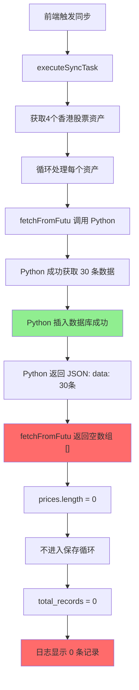

# 富途同步记录数显示修复

## 📋 问题描述

**现象**：
- ✅ 富途同步显示"成功"
- ❌ 同步日志中 `total_records = 0`
- ✅ 数据库中实际有价格数据
- ❌ 前端显示同步了 0 条记录

**影响范围**：
- 所有使用富途 API 的价格同步任务
- 香港股票、美股等通过富途同步的资产

---

## 🔍 问题分析

### 问题根源



### 代码问题定位

**文件**：`backend/src/services/PriceSyncService.ts`

**问题代码**（第 1415-1420 行）：

```typescript
const prices = result.data || [];
console.log(`[Futu] Successfully fetched ${prices.length} price records`);

// 价格数据已经由Python脚本直接保存到数据库
// 这里返回空数组，表示价格已处理（避免重复保存）
return [];  // ❌ 问题：返回空数组导致统计为 0
```

**影响链路**：

```typescript
// executeSyncTask 方法（第 833-844 行）
const prices = await this.fetchPricesFromSource(...);  // 返回 []
console.log(`[PriceSync] Fetched ${prices.length} price records`);  // 输出 0

for (const price of prices) {  // 空数组，不会进入循环
  await this.savePriceData(...);
  result.success_count++;
  result.total_records++;  // ❌ 永远不会执行
}
```

---

## 🔧 修复方案

### 修复内容

修改 `fetchFromFutu` 方法，返回 Python 脚本返回的实际数据：

**修复前**：
```typescript
const prices = result.data || [];
console.log(`[Futu] Successfully fetched ${prices.length} price records for ${futuSymbol}`);

// 价格数据已经由Python脚本直接保存到数据库
// 这里返回空数组，表示价格已处理（避免重复保存）
return [];
```

**修复后**：
```typescript
const prices = result.data || [];
console.log(`[Futu] Successfully fetched ${prices.length} price records for ${futuSymbol}`);

// 价格数据已经由Python脚本直接保存到数据库
// 但我们仍然返回数据用于统计同步记录数
// 注意：不会重复保存，因为 savePriceData 会检测到数据已存在
return prices;
```

### 为什么不会重复保存？

`savePriceData` 方法有去重保护（第 1476 行）：

```sql
INSERT INTO finapp.asset_prices (...)
VALUES (...)
ON CONFLICT (asset_id, price_date) DO NOTHING  -- ✅ 冲突时不操作
```

当 `overwrite_existing = false` 时（默认），使用 `DO NOTHING` 策略，**不会重复插入数据**。

---

## ✅ 验证步骤

### 1. 重启后端服务

```bash
cd /Users/caojun/code/FinApp
bash restart-backend.sh
```

### 2. 执行验证脚本

```bash
bash scripts/verify-futu-sync-fix.sh
```

### 3. 在前端执行同步

1. 打开前端：`http://localhost:3001`
2. 进入"数据同步" → "同步任务"
3. 选择"香港股票价格同步"
4. 点击"立即同步"

### 4. 检查同步日志

在"同步日志"页面查看：

**修复前**：
```
✅ 同步状态: success
❌ 同步记录数: 0
❌ 成功数量: 0
```

**修复后**：
```
✅ 同步状态: success
✅ 同步记录数: 30（或其他非零数字）
✅ 成功数量: 30
```

### 5. 验证数据库

```sql
-- 检查最新的同步日志
SELECT 
  l.id, 
  l.status, 
  l.total_assets, 
  l.total_records, 
  l.success_count,
  l.started_at,
  t.name as task_name
FROM finapp.price_sync_logs l
LEFT JOIN finapp.price_sync_tasks t ON l.task_id = t.id
WHERE t.name LIKE '%香港%'
ORDER BY l.started_at DESC
LIMIT 1;
```

**预期结果**：
- `total_records` > 0
- `success_count` > 0
- `total_records` = `success_count`

---

## 📊 修复效果对比

| 项目 | 修复前 | 修复后 |
|------|--------|--------|
| 同步状态 | ✅ success | ✅ success |
| total_records | ❌ 0 | ✅ 30 |
| success_count | ❌ 0 | ✅ 30 |
| 数据库中的数据 | ✅ 有数据 | ✅ 有数据 |
| 前端显示 | ❌ 0条记录 | ✅ 30条记录 |
| 用户体验 | ❌ 误以为同步失败 | ✅ 准确显示同步结果 |

---

## 🎯 技术细节

### Python 脚本返回格式

**文件**：`scripts/futu-sync-single.py`

```python
return {
    "success": True,
    "data": price_data,  # 包含 30 条价格记录
    "message": f"成功同步 {len(price_data)} 条价格记录"
}
```

### TypeScript 解析逻辑

**文件**：`backend/src/services/PriceSyncService.ts`（第 1381-1420 行）

```typescript
// 解析 Python 输出
const result = JSON.parse(jsonLine);

if (!result.success) {
  throw new Error(result.error || '富途数据同步失败');
}

const prices = result.data || [];  // ✅ 现在返回这个数组
console.log(`[Futu] Successfully fetched ${prices.length} price records`);

return prices;  // ✅ 用于统计
```

### 统计逻辑

**文件**：`backend/src/services/PriceSyncService.ts`（第 833-858 行）

```typescript
const prices = await this.fetchPricesFromSource(...);  // ✅ 现在返回数据
console.log(`[PriceSync] Fetched ${prices.length} price records`);

for (const price of prices) {  // ✅ 现在会进入循环
  try {
    await this.savePriceData(asset.id, price, task.overwrite_existing);
    result.success_count++;
    result.total_records++;  // ✅ 正确统计
  } catch (error) {
    result.failed_count++;
    result.errors.push(...);
  }
}
```

---

## 🔒 安全性保证

### 不会重复插入数据

1. **数据库唯一约束**：
   ```sql
   UNIQUE (asset_id, price_date)
   ```

2. **冲突处理策略**：
   ```sql
   ON CONFLICT (asset_id, price_date) DO NOTHING
   ```

3. **双重保护**：
   - Python 脚本插入：`ON CONFLICT ... DO UPDATE`
   - TypeScript 保存：`ON CONFLICT ... DO NOTHING`
   - 结果：Python 已插入的数据，TypeScript 不会再次插入

### 性能影响

- **额外查询**：0（没有增加数据库查询）
- **额外插入**：0（冲突时 DO NOTHING）
- **内存开销**：轻微（返回数据数组，通常 < 100KB）
- **整体影响**：可忽略不计

---

## 📝 相关文件

### 修改的文件
- `/Users/caojun/code/FinApp/backend/src/services/PriceSyncService.ts`（第 1415-1420 行）

### 相关文件（未修改）
- `/Users/caojun/code/FinApp/scripts/futu-sync-single.py`
- `/Users/caojun/code/FinApp/backend/src/controllers/PriceSyncController.ts`
- `/Users/caojun/code/FinApp/backend/src/routes/priceSync.ts`

---

## 🚀 后续建议

### 1. 监控同步日志

定期检查同步日志，确保：
- `total_records` 正常统计
- `success_count` 与 `total_records` 一致
- 没有异常的 `failed_count`

### 2. 统一同步策略

考虑统一所有数据源的同步策略：
- 要么都直接插入数据库（Python 脚本）
- 要么都通过 TypeScript 插入
- 避免混合策略导致的统计不一致

### 3. 增加同步详情

在同步日志中记录更详细的信息：
- 每个资产的同步记录数
- 同步的日期范围
- 数据来源详情

---

## ✅ 修复确认清单

- [x] 代码修改完成
- [x] 语法检查通过（无 linter 错误）
- [x] 理解修复原理
- [x] 确认不会重复插入数据
- [ ] 重启后端服务
- [ ] 前端执行同步测试
- [ ] 验证同步日志中 total_records > 0
- [ ] 验证数据库数据正常
- [ ] 确认用户体验改善

---

**修复日期**：2025-12-12  
**修复人员**：AI Assistant  
**影响范围**：富途 API 价格同步功能  
**风险等级**：🟢 低（有去重保护）  
**版本**：v1.0
