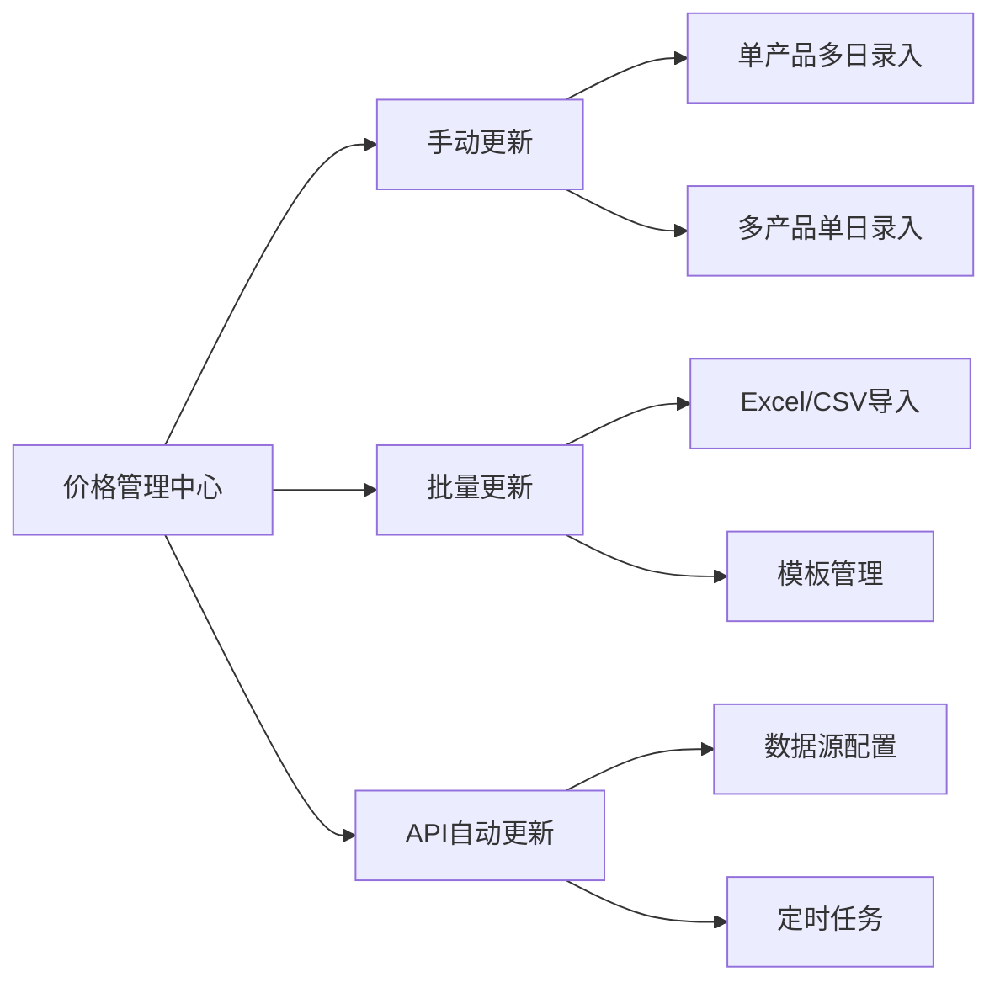

# 产品价格更新功能重新设计

## 🎯 目标
- 提升价格更新功能的易用性
- 支持手动更新、批量更新、API自动更新
- 优化不同资产类型的更新频率管理

## 📊 设计方案

### 1️⃣ 核心功能模块


### 2️⃣ 技术实现

#### 前端组件结构
```
src/pages/admin/PriceManagement/
├── QuickEntry/       # 手动更新
├── BatchImport/      # 批量导入
└── ApiSync/         # API自动更新
```

#### 后端API增强
- 新增批量价格更新端点
- 优化数据验证逻辑
- 支持不同更新频率

## 🗓️ 开发计划

### Phase 1: 基础功能 ✅ (已完成)
- ✅ 单产品多日录入组件
- ✅ 多产品单日录入组件
- ✅ 批量价格更新 API
- ✅ 数据验证逻辑
- ✅ 用户界面优化

### Phase 2: 批量导入 ✅ (已完成)
- ✅ Excel/CSV导入
- ✅ 模板管理
- ✅ 导入预览

### Phase 3: API集成 ✅ (已完成)
- ✅ 数据源配置
- ✅ 定时任务
- ✅ 自动同步

### Phase 4: 优化测试 (计划中)
- ⏳ 用户体验优化
- ⏳ 完整测试
- ⏳ 性能优化

## 📝 Phase 1 详细设计

### 1. 单产品多日录入 (SingleAssetMultiDate)

**功能特性：**
- 选择单个产品，录入多个日期的价格数据
- 支持收盘价（必填）+ OHLC（可选）
- 自动验证价格逻辑（最低价 ≤ 开盘价/收盘价 ≤ 最高价）
- 检测重复日期
- 动态添加/删除行
- 实时统计有效记录数

**技术实现：**
```typescript
// 前端组件路径
frontend/src/pages/admin/PriceManagement/QuickEntry/SingleAssetMultiDate.tsx

// 数据结构
interface PriceRecord {
  key: string;
  date: Dayjs | null;
  closePrice: number | null;  // 必填
  openPrice?: number | null;   // 可选
  highPrice?: number | null;   // 可选
  lowPrice?: number | null;    // 可选
}

// API 调用
POST /api/assets/prices/bulk
{
  updates: [
    {
      assetId: string,
      priceDate: string,
      closePrice: number,
      openPrice?: number,
      highPrice?: number,
      lowPrice?: number,
      currency: string,
      dataSource: 'MANUAL'
    }
  ]
}
```

**验证规则：**
1. 必须选择产品
2. 至少有一条完整记录（日期 + 收盘价）
3. 不能有重复日期
4. 如果填写了最高价和最低价：
   - 最高价 ≥ 最低价
   - 最低价 ≤ 收盘价 ≤ 最高价
   - 最低价 ≤ 开盘价 ≤ 最高价（如果填写了开盘价）

### 2. 多产品单日录入 (MultiAssetSingleDate)

**功能特性：**
- 选择单个日期，录入多个产品的价格数据
- 支持收盘价（必填）+ OHLC（可选）
- 自动验证价格逻辑
- 防止重复添加同一产品
- 动态添加/删除产品行
- 实时统计有效记录数

**技术实现：**
```typescript
// 前端组件路径
frontend/src/pages/admin/PriceManagement/QuickEntry/MultiAssetSingleDate.tsx

// 数据结构
interface PriceRecord {
  key: string;
  asset: Asset | null;
  closePrice: number | null;  // 必填
  openPrice?: number | null;   // 可选
  highPrice?: number | null;   // 可选
  lowPrice?: number | null;    // 可选
}

// API 调用（同上）
POST /api/assets/prices/bulk
```

**验证规则：**
1. 必须选择日期
2. 至少有一条完整记录（产品 + 收盘价）
3. 不能重复添加同一产品
4. 价格逻辑验证（同单产品多日录入）

### 3. 后端批量价格更新 API

**端点：** `POST /api/assets/prices/bulk`

**请求体：**
```json
{
  "updates": [
    {
      "assetId": "uuid",
      "priceDate": "YYYY-MM-DD",
      "closePrice": 100.50,
      "openPrice": 99.80,
      "highPrice": 101.20,
      "lowPrice": 99.50,
      "currency": "CNY",
      "dataSource": "MANUAL"
    }
  ]
}
```

**响应：**
```json
{
  "success": true,
  "data": {
    "totalRecords": 10,
    "successCount": 10,
    "errorCount": 0,
    "errors": []
  },
  "message": "成功保存 10 条价格记录"
}
```

**实现逻辑：**
1. 验证请求数据格式
2. 使用事务处理所有更新
3. 对每条记录：
   - 验证资产是否存在
   - 验证收盘价 > 0
   - 使用 UPSERT 插入或更新价格（基于 asset_id + price_date 唯一约束）
4. 返回成功/失败统计

**数据库操作：**
```sql
INSERT INTO asset_prices (
  asset_id, price_date, open_price, high_price, low_price, 
  close_price, volume, adjusted_close, currency, data_source
) VALUES (...)
ON CONFLICT (asset_id, price_date) 
DO UPDATE SET
  open_price = EXCLUDED.open_price,
  high_price = EXCLUDED.high_price,
  low_price = EXCLUDED.low_price,
  close_price = EXCLUDED.close_price,
  volume = EXCLUDED.volume,
  adjusted_close = EXCLUDED.adjusted_close,
  currency = EXCLUDED.currency,
  data_source = EXCLUDED.data_source
```

### 4. 用户界面设计

**布局结构：**
```
价格管理中心
├── Tab: 单产品多日录入
│   ├── 产品选择器（搜索）
│   ├── 产品信息卡片
│   ├── 价格数据表格
│   │   ├── 日期选择器
│   │   ├── 收盘价输入（必填）
│   │   ├── 开盘价输入（可选）
│   │   ├── 最高价输入（可选）
│   │   ├── 最低价输入（可选）
│   │   └── 操作按钮（删除）
│   ├── 工具栏（添加行、清空）
│   ├── 保存按钮（显示有效记录数）
│   └── 使用说明
│
└── Tab: 多产品单日录入
    ├── 日期选择器
    ├── 日期信息卡片
    ├── 价格数据表格
    │   ├── 产品选择器（搜索）
    │   ├── 币种显示
    │   ├── 收盘价输入（必填）
    │   ├── 开盘价输入（可选）
    │   ├── 最高价输入（可选）
    │   ├── 最低价输入（可选）
    │   └── 操作按钮（删除）
    ├── 工具栏（添加产品、清空）
    ├── 保存按钮（显示有效记录数）
    └── 使用说明
```

**交互特性：**
- 产品搜索：输入至少2个字符触发搜索
- 实时验证：输入时进行客户端验证
- 统计显示：实时显示有效记录数
- 确认对话框：清空数据前需要确认
- 加载状态：保存时显示加载动画
- 错误提示：详细的错误信息提示

## 📊 测试要点

### 功能测试
- [ ] 单产品多日录入正常流程
- [ ] 多产品单日录入正常流程
- [ ] 产品搜索功能
- [ ] 数据验证逻辑
- [ ] 重复数据处理
- [ ] 批量保存功能

### 边界测试
- [ ] 空数据提交
- [ ] 无效日期
- [ ] 负数价格
- [ ] 价格逻辑错误（最高价 < 最低价）
- [ ] 重复日期/产品
- [ ] 大批量数据（100+ 条）

### 错误处理
- [ ] 网络错误
- [ ] 服务器错误
- [ ] 权限错误
- [ ] 数据库错误

## 🎯 下一步计划

Phase 2 将实现：
1. Excel/CSV 批量导入功能
2. 导入模板下载
3. 数据预览和验证
4. 错误报告和修正